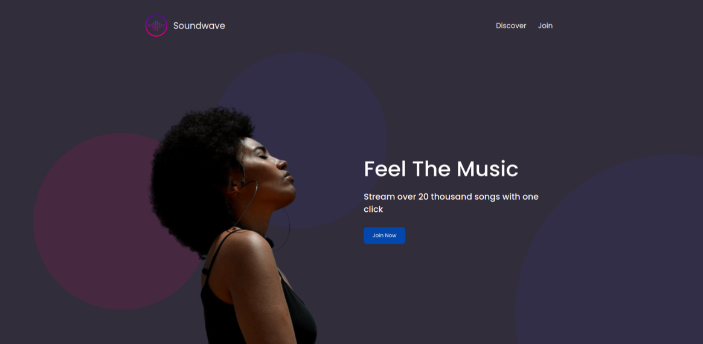
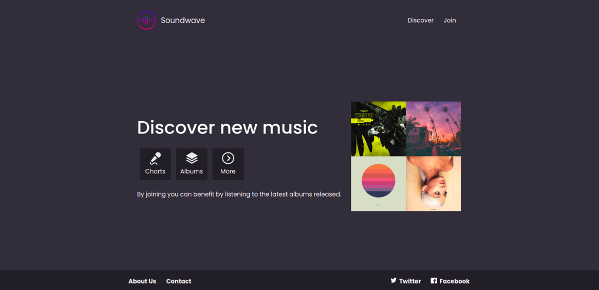
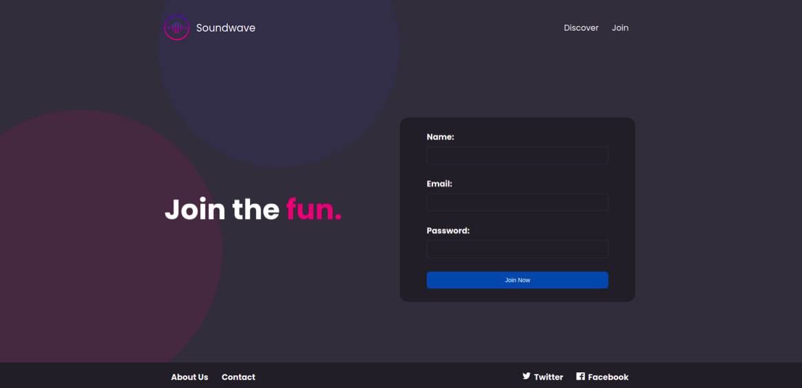
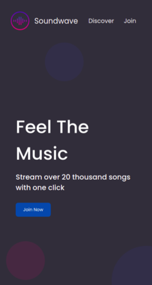
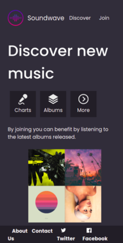
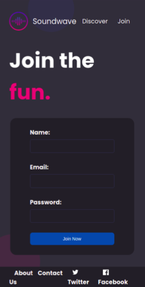

### Team: EqualWaveStudio

# 🎧 Sound Wave Proyect

Dynamic and fully responsive web page, developed with the React.js framework, with functional components, making use of hooks, using react-router-dom and some of the following styling technologies for React: CSS modules, styled components with SweetAlert library.

_Project phases:_
  
 -  **Inception, Team Organization and planification**
  - **Weekly Sprints**
  - **Mockups**  (Desktop version first, Mobile version, Tablet, Responsive)
  - **Code**
  - **Demo**
  - **Test**
   
# Mockups

## Desktop

## Movil

## 💻 Technologies

 

 

 

## 🛠 Tools

  

### 💻 A list of another technologies used in this proyect

A list of technologies or tools used within the project:
* [Sweet Alert 2](https://sweetalert2.github.io/): Version 11.7.12.  
* [React Hook Form](https://react-hook-form.com/): Version 7.45.0.
*  [Visual Studio Code](https://code.visualstudio.com/): Version 1.79.
*  [Slack](https://slack.com/intl/es-es)
*  [Zoom](https://zoom.us/es)

## 👾 Developers

- Laura García (garch.laura@gmail.com)
- Jacinemi Urquiola Alvarez
- Jeaneth Sánchez Núñez
- Ana Lucía Silva Córdoba (coderalsc@gmail.com)
- Rafaela Silveira Prieto (todaunabossa@gmail.com)

